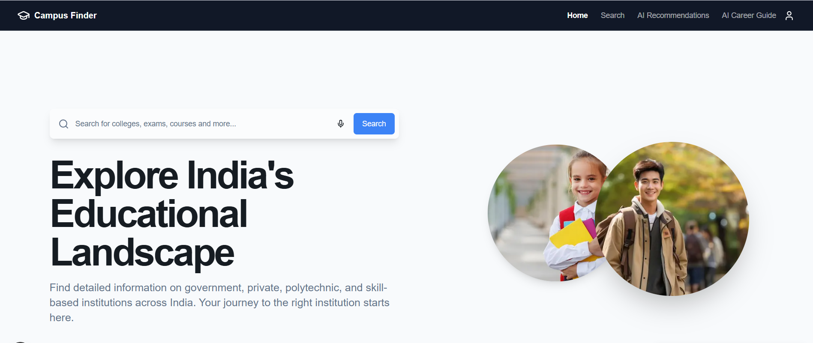

# Campus Finder: An AI-Powered Recommendation System for Personalized Discovery of Indian Educational Institutions



Welcome to Campus Finder, a comprehensive web application built with Next.js that serves as a one-stop-shop for discovering and evaluating educational institutions across India. This platform is designed to empower students and parents with the data they need to make informed decisions about their educational future.

## Key Features

- **Comprehensive Search**: Users can search for thousands of institutions by name, location, or course.
- **Advanced Filtering**: Narrow down results by filtering based on institution type, state, city, **NIRF Ranking**, and **NAAC Grade**.
- **Detailed Institution Profiles**: Every institution has a rich profile page featuring courses, fees, placements, and campus infrastructure.
- **Functional User Reviews**: Authenticated users can submit real-time ratings and reviews for institutions.
- **Side-by-Side Comparison**: Select and compare two institutions based on their key attributes with AI-powered analysis.
- **Personalization**:
  - **Favorites**: Save institutions to a personal list for easy access.
  - **History**: Keep track of recently viewed institutions.
- **AI-Powered Tools**:
  - **AI Recommendations**: Get personalized suggestions based on natural language criteria.
  - **AI Career Guide**: An interactive AI assistant for career-related guidance.

## Tech Stack

This project is built with a modern, production-ready tech stack:

- **Framework**: **Next.js 15.3.8 (App Router)** - For high-performance SSR and SEO with Turbopack
- **Language**: **TypeScript** - Ensuring type-safety and maintainability
- **UI Components**: **ShadCN/UI** - Beautifully designed, accessible components built on Radix UI
- **Styling**: **Tailwind CSS** - Utility-first approach for responsive design
- **Client-Side State**: **React Hooks & localStorage** - Persistent user data without a heavy backend
- **Generative AI**: **Google Genkit** - Orchestrating Gemini LLM for intelligent features
- **Forms**: **React Hook Form & Zod** - Robust validation and state management
- **Icons**: **Lucide React** - Consistent icon system
- **Animations**: **Framer Motion** - Smooth animations and transitions
- **Charts**: **Recharts** - Data visualization for statistics and comparisons

## Role of Generative AI

Generative AI is the core intelligence of Campus Finder. Using **Google's Genkit** and the **Gemini LLM**, the system provides:
1. **Intelligent Recommendations**: Interprets natural language queries to find matches based on complex criteria.
2. **Career Counseling**: Acts as an expert counselor to provide roadmaps, skill requirements, and future scopes.
3. **Automated Comparison**: Reasons through placement data and rankings to declare winners and provide justified recommendations.

## System Architecture

The application is structured into a 4-tier architecture:
1. **Presentation Tier**: Next.js, Tailwind, ShadCN.
2. **State Management Tier**: Custom Hooks + LocalStorage.
3. **Intelligence Tier**: Google Genkit + Gemini LLM.
4. **Content Management Tier**: Admin Dashboard for database expansion.

## Project Structure

```
campus-finder/
├── src/
│   ├── app/                    # Next.js App Router pages
│   │   ├── (admin)/           # Admin dashboard routes
│   │   ├── (auth)/            # Authentication routes
│   │   ├── (main)/            # Main application routes
│   │   ├── globals.css        # Global styles
│   │   └── layout.tsx         # Root layout
│   ├── components/            # Reusable UI components
│   ├── hooks/                 # Custom React hooks
│   ├── lib/                   # Utility functions and configurations
│   └── ai/                    # AI-related configurations and prompts
├── docs/                      # Documentation files
├── .env.example               # Environment variables template
├── package.json               # Project dependencies and scripts
└── README.md                  # This file
```

## Installation & Setup

### Prerequisites
- Node.js (v18 or higher)
- npm or yarn package manager

### Getting Started

1. **Clone the repository**
   ```bash
   git clone <repository-url>
   cd campus-finder
   ```

2. **Install dependencies**
   ```bash
   npm install
   ```

3. **Set up environment variables**
   ```bash
   cp .env.example .env
   ```
   
   Update the `.env` file with your API keys:
   ```env
   NEXT_PUBLIC_GOOGLE_MAPS_API_KEY=your_google_maps_api_key
   GEMINI_API_KEY=your_gemini_api_key
   ```

4. **Run the development server**
   ```bash
   npm run dev
   ```
   
   The application will be available at [http://localhost:9002](http://localhost:9002)

5. **Optional: Start Genkit development server**
   ```bash
   npm run genkit:dev
   ```
   
   This starts the Genkit development server on port 9003 for AI features.

### Available Scripts

- `npm run dev` - Start development server with Turbopack on port 9002
- `npm run build` - Build the application for production
- `npm run start` - Start production server
- `npm run lint` - Run ESLint
- `npm run typecheck` - Run TypeScript type checking
- `npm run genkit:dev` - Start Genkit development server on port 9003
- `npm run genkit:watch` - Watch for changes in Genkit files

## Using the Application

1. **Landing Page**: The application starts with a landing page. Click "Enter" to access the main features.
2. **Explore Institutions**: Use the search and filter functionality to discover educational institutions.
3. **AI Recommendations**: Leverage AI-powered recommendations based on your preferences.
4. **Compare Institutions**: Use the side-by-side comparison feature to evaluate multiple institutions.
5. **Personalization**: Create an account to save favorites, track history, and contribute reviews.

---
© 2026 Campus Finder. All rights reserved.
